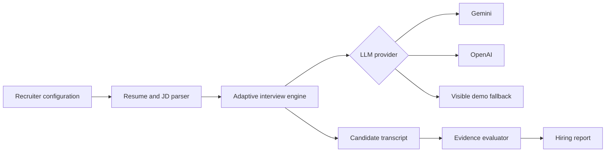
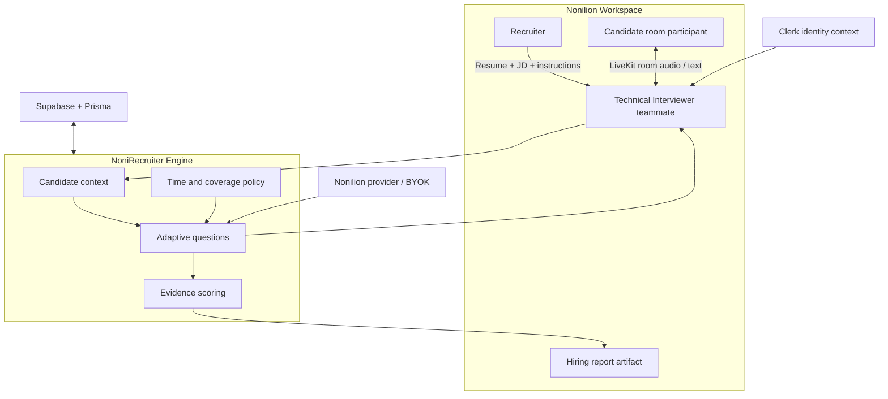

# Architecture

## Current prototype

The CLI is an adapter around the interview engine. Provider, timing, coverage, evaluation, and report logic remain independent from the interface.

## Proposed Nonilion integration

### Integration principle

NoniRecruiter should extend the platform rather than duplicate it:

- Nonilion owns workspace identity, rooms, provider settings, and persistence boundaries.
- NoniRecruiter owns interview policy, timing, adaptive probing, evidence evaluation, and report structure.
- LiveKit is a proposed transport around the existing text-first engine.
- STT and TTS remain provider adapters until Nonilion confirms its internal standard.

The proposed components are documented in detail in [NONILION_INTEGRATION.md](NONILION_INTEGRATION.md).
